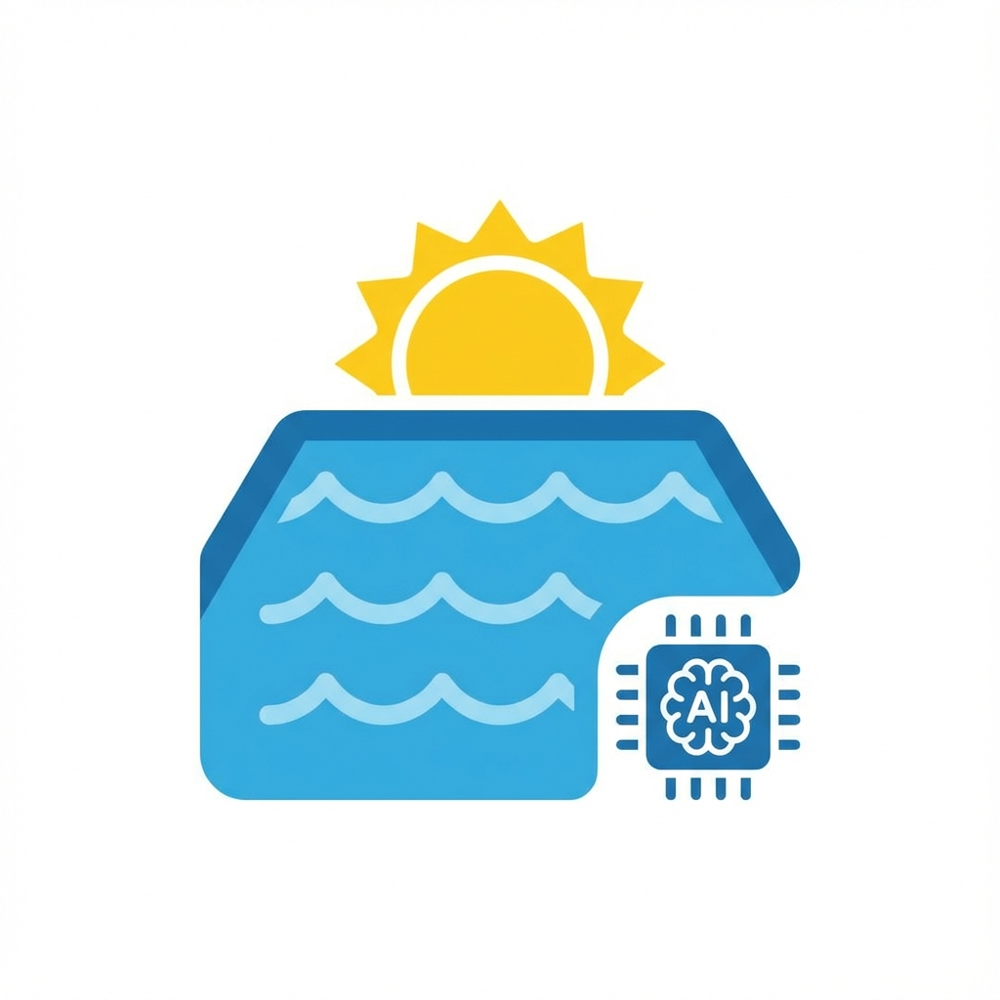
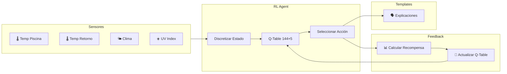
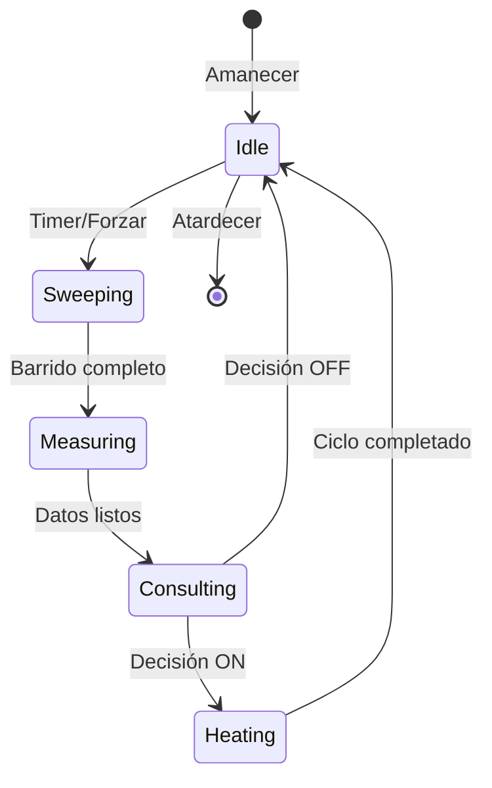

# SolarPool AI (Home Assistant Custom Component)

<p align="center">
  
</p>

[](https://github.com/hacs/integration)
[](https://github.com/pabloantonelli/solar-pool-ai/releases)

SolarPool AI es una integración para Home Assistant que automatiza la climatización de piscinas utilizando colectores solares y **Reinforcement Learning (Q-Learning)** para tomar decisiones óptimas sin costos de APIs externas.

## 🚀 Características

- **🧠 Reinforcement Learning Local**: Aprende de tu sistema específico sin depender de APIs externas
- **⏱️ Monitoreo de Alta Frecuencia**: Ciclos cada 10 min para una respuesta inmediata a cambios de clima
- **⚖️ Análisis de Ventana (Estabilidad)**: Algoritmo de varianza que asegura lecturas térmicas reales en cualquier sensor (v2.1.2)
- **🛡️ Protección de Bomba**: Tiempo mínimo de ejecución (10 min) para evitar arranques frecuentes
- **🌍 Políglota Regional**: Soporte para Español (Arg/Esp), Inglés, Portugués (Br), Francés y Alemán (v2.1.5)
- **🎨 UI Limpia**: Entidades categorizadas en Principal, Configuración y Diagnóstico (v2.1.4)
- **💰 Cero Costos**: Sin gastos en APIs de IA (anteriormente $6-60/mes)
- **⚡ Respuestas Instantáneas**: Decisiones en microsegundos vs 1-3 segundos con LLMs
- **🔒 100% Offline**: Funciona sin conexión a internet
- **🛡️ Seguridad Multicapa**: 
  - Protección de delta térmico mínimo (2.0°C)
  - Límites de duración (20-90 min)
  - Warm-up conservador (primeros 50 ciclos)
  - Apagado automático al atardecer

## 🏗️ Arquitectura



## 🛠️ Instalación mediante HACS

1. Abre **HACS** en tu instancia de Home Assistant
2. Ve a **Integraciones**
3. Haz clic en los tres puntos → **Repositorios personalizados**
4. Pega: `https://github.com/pabloantonelli/solar-pool-ai`
5. Selecciona **Integración** y haz clic en **Añadir**
6. Busca "SolarPool AI" e instálala
7. Reinicia Home Assistant

## ⚙️ Configuración

Ve a **Ajustes** > **Dispositivos y Servicios** > **Añadir Integración** > **SolarPool AI**

Necesitarás configurar:
- **Entidades**: Bomba, sensor de piscina, sensor de retorno, entidad de clima
- **Idioma**: Español (Argentina/España), English, Português, Français o Deutsch
- **Parámetros**: Barrido máximo, temperatura máxima, intervalo de consulta

> ⚠️ **No requiere API Keys** - El sistema aprende localmente usando Reinforcement Learning

## 📊 Entidades Expuestas

### Sensores de Operación (Principales)
| Entidad | Descripción |
|---------|-------------|
| `sensor.solarpool_status` | Estado actual traducido |
| `sensor.solarpool_reasoning` | **Explicación narrativa** de la decisión actual |
| `sensor.solarpool_next_run` | Próxima evaluación automática |
| `sensor.solarpool_expected_gain` | Ganancia térmica esperada (°C) |

### Parámetros (Categoría: Configuración)
| Entidad | Descripción | Rango |
|---------|-------------|-------|
| `number.solarpool_temperatura_maxima` | Temperatura máxima del agua | 20-40°C |
| `number.solarpool_barrido_maximo` | Timeout de barrido (Análisis de Ventana) | 60-600s |
| `number.solarpool_intervalo_de_consulta` | Frecuencia de evaluación | 5-120min |
| `switch.solarpool_master` | Habilitar/Deshabilitar automatización | On/Off |

### Diagnóstico (Categoría: Diagnóstico)
| Entidad | Descripción | Valor |
|---------|-------------|-------|
| `sensor.solarpool_rl_phase` | Fase actual de entrenamiento | Traducido |
| `sensor.solarpool_rl_episodes` | Total de ciclos aprendidos | Contador |
| `sensor.solarpool_rl_epsilon` | Tasa de exploración | 0.05 a 0.30 |
| `sensor.solarpool_rl_reward` | Recompensa del último ciclo | Eficiencia |
| `button.solarpool_force_cycle` | Forzar evaluación inmediata | Acción |

## 🧠 Innovaciones de la v2.1

### ⚖️ Estabilidad mediante Análisis de Ventana (v2.1.2)
El sistema ya no compara puntos aislados. Ahora utiliza un **Análisis de Ventana de Varianza**: acumula lecturas durante los primeros 60s y solo procede si la diferencia entre el máximo y el mínimo de la ventana es menor a **0.2°C**. Esto lo hace compatible con *cualquier* tipo de sensor, sin importar su frecuencia de refresco.

### 🛡️ Protección de Ciclo Corto (v2.1.1)
Para proteger la vida útil de la bomba, se implementa un **Tiempo Mínimo de Ejecución de 10 minutos** (Sweep + Heating). Si el agente RL decide apagar pero la bomba lleva menos tiempo, el sistema mantendrá la operación hasta cumplir el mínimo de seguridad.

## 🧠 Cómo Funciona el RL

### Estados (144 combinaciones)
El agente discretiza las condiciones en:
- **Delta T** (retorno - piscina): 4 niveles (0-2, 2-4, 4-6, 6+°C)
- **UV Index**: 4 niveles (0-3, 3-6, 6-9, 9+)
- **Viento**: 3 niveles (0-15, 15-30, 30+ km/h)
- **Elevación Solar**: 3 niveles (0-20, 20-45, 45+°)

### Acciones (5 opciones)
| Acción | Descripción |
|--------|-------------|
| OFF | Bomba apagada |
| ON 20min | Calentamiento corto |
| ON 40min | Calentamiento medio |
| ON 60min | Calentamiento largo |
| ON 90min | Calentamiento máximo |

### Recompensas
```
recompensa = ganancia_real_°C - (costo_bomba × horas)
```
- Decisiones eficientes → recompensas positivas
- Decisiones ineficientes → recompensas negativas

### Fases de Aprendizaje

| Fase | Episodios | Comportamiento |
|------|-----------|----------------|
| **Bootstrap** | 1-10 | Reglas conservadoras (delta>4°C, UV>5) |
| **Training** | 11-50 | 30% exploración, 70% explotación |
| **Production** | 50+ | 5% exploración, 95% explotación |

## 🌍 Ejemplos de Explicaciones

### Español 🇪🇸
```
☀️ Sol fuerte y viento calmo. ¡Aprovechamos al máximo!
💨 Viento de 25km/h enfría los colectores.
📉 Solo 1.5°C de diferencia. Necesitamos al menos 2°C.
🤖 Probando nueva estrategia. Después te cuento cómo salió.
```

### English 🇬🇧
```
☀️ Strong sun, calm wind. Let's heat up!
💨 25km/h wind cools the collectors.
📉 Only 1.5°C difference. Need at least 2°C.
🤖 Testing new strategy. I'll report back.
```

## � Ciclo de Operación



## 📋 Historial de Versiones

| Versión | Cambios principales |
|---------|---------------------|
| **0.0.1** | 🚀 Lanzamiento inicial BETA: Reinforcement Learning Local, Análisis de Ventana, Multilenguaje Regional y UI Optimizada. |

---

**Nota**: Este componente utiliza Reinforcement Learning local. No requiere conexión a internet ni APIs externas para funcionar.
